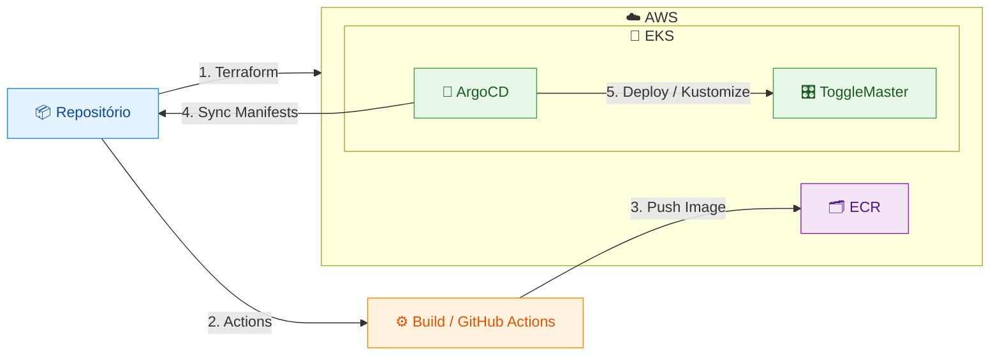

# Tech Challenge Fase 3 - IaaS "ToggleMaster"

> Análise geral e implementação comentada do "desafio" da Fase 3 do curso DevOps e Arquitetura Cloud da FIAP.

Nesta fase, o projeto propõe a criação **automática** de um ambiente distribuído em "_cloud_", focado na AWS, para a execução dos microserviços do sistema ToggleMaster ([o mesmo da Fase 2][fase2]).

A ToggleMaster é uma solução que permite ativar ou desativar _features_ em produção sem a necessidade de um novo _deploy_. Ela foi criada para que times de desenvolvimento possam lançar novas funcionalidades de forma segura e controlada.

 

## 🏗️ Arquitetura

O projeto da ToggleMaster com IaaS é composto por alguns recursos principais: os **microserviços**, a **infraestrutura _cloud_** e os **módulos do Kubernetes**. Esses recursos são integrados por meio de algumas ferramentas que também são descritas mais adiante.

O sistema ToggleMaster é segmentado em 5 microsserviços altamente integrados entre si. São eles: [`auth-service`][authserv], [`flag-service`][flagserv], [`targeting-service`][targetserv], [`evaluation-service`][evalserv] e [`analytics-service`][analyticserv], cada um com seu respectivo repositório original, criado pela FIAP.

Os microserviços são executados em um _cloud provider_, a AWS, para permitir alta flexibilidade, escalabilidade e segurança ao sistema. A infraestrutura da AWS é implementada com o Terraform, e foi segmentada em módulos a fim de automatizar e flexibilizar a criação do ambiente.

Com o ambiente AWS criado, os microsserviços, então, são executados em um cluster Kubernetes (K8s), o EKS da AWS. Diversos manifestos K8s foram criados para definir como o sistema ToggleMaster deve ser executado e escalado nesse ambiente. Também é implementado no cluster o ArgoCD, para que o _deploy_ seja automatizado e sincronizado com o repositório Git, tornando-o o ponto central de controle e manutenção do código do sistema.

De forma simplificada, este é o fluxo geral de implementação do sistema ToggleMaster:

 

Além disso, a organização deste repositório é intencional. Os principais diretórios são separados em:

- _`root`_ - infraestrutura (_Terraform_) e configurações do repositório;
- `kube` - manifestos Kubernetes, autocontidos e portáveis;
- `argo` - definições de deploy com o ArgoCD;
- `build` - código-fonte dos microserviços da ToggleMaster.

A intenção é manter os arquivos contidos em diretórios próprios, preservar a separação de responsabilidades e permitir relativa portabilidade entre ambientes. 

 

## 🔑 Prerequisitos

**1.** De preferência, faça um **"_fork_" deste repositório** para possibilitar a execução do CI workflow. Ele é utilizado para testar e, principalmente, para enviar as imagens dos microserviços ao AWS ECR.
> **É necessário habilitar o serviço de `Actions` no repositório.**

**2.** Copie todo o código-fonte do repositório para um ambiente de execução/desenvolvimento local. Recomenda-se **clonar o repositório com o Git**:
> **`git clone https://github.com/SUA_CONTA/FORK_DO_REPO.git && cd FORK_DO_REPO`**

**3.** O ambiente de execução/desenvolvimento local deve estar **autenticado na AWS** com o [**AWS CLI**][awscli], pois ele será utilizado em algumas configurações mais adiante.

**4.** É necessário [**instalar o Terraform**][terraform] no ambiente de execução/desenvolvimento local para implementar os serviços da AWS que serão utilizados pelo sistema ToggleMaster;

**5.** O **`kubectl`** é necessário para gerenciar o cluster Kubernetes e seus recursos. Recomenda-se instalá-lo utilizando o [**repositório oficial do Kubernetes**][kuberepo];

**6.** _(Opcional)_ O [**cliente ArgoCD CLI**][argocdcli] pode ser instalado no ambiente local para auxiliar nas configurações da ToggleMaster no cluster. No roteiro de implementação, são apresentados alguns exemplos que o utilizam. No entanto, também é possível sincronizar os manifestos da ToggleMaster diretamente na interface do ArgoCD.

 

---

### [↗️ Roteiro de implementação](/roteiro/)

---

 

## 📝 Considerações

🔶 A depender do ambiente de repositórios Git utilizado na criação do _CI workflow_, podem haver diferenças ou limitações nas ações. São oferecidos _workflows_ para o **Gitea** e para o **GitHub**.  No entanto, os workflows são muito flexíveis para diferentes cenários.

🔶 A autenticação do Git Action na AWS pode ser feita com o OpenID Connect (OIDC). Porém, devido à relação de certificados e restrições em portas de serviços, o uso de _secrets_ do repositório pode ser necessário para ambientes de CI fora do GitHub, como ambientes _self-hosted_. Por exemplo, foi necessário utilizar o AWS CLI em algumas etapas do workflow do Gitea para evitar variáveis e suposições específicas do GitHub em ações pré-definidas.

🔶 É possível realizar o teste de verificação de vulnerabilidades das imagens dos microserviços diretamente na AWS; no entanto, podem haver custos implícitos.

🔶 Devido ao volume de serviços implementados no cluster EKS - como Keda, Helm, ArgoCD, External Secrets, o próprio cluster, e ToggleMaster -, a quantidade de pods pode ser um pouco elevada, principalmente se houver escalonamento de pods. No Kubernetes, cada pod recebe um endereço IP privado. Portanto, é necessário definir uma instância EC2 da AWS que permita um número maior de [alocações de IPs por interface][ipalloc]. Neste projeto, foi utilizada a instância `m7i-flex.large`, elegível como "_free tier_", e permite até 10 alocações de IPs.

🔶 Apesar de o sistema ToggleMaster ser bastante flexível e, em parte, desacoplado, a infraestrutura proposta para ele é altamente complexa e interdependente. Como visto no [código atual do sistema][codatual], e apesar dos [princípios dos 12 Fatores discutidos na Fase 1][12factor] do projeto, a ToggleMaster está desacoplada, mas ainda possui alta dependência entre seus componentes. A situação se agrava ao introduzir o _cloud provider_ como serviço de hospedagem da aplicação. Nesse caso, a infraestrutura da AWS mostra-se mais complexa e dispendiosa para hospedar a ToggleMaster, gerando um custo operacional possivelmente elevado.

🔶 Devido aos requisitos do desafio nesta Fase 3, os recursos da AWS são altamente integrados e dependentes entre si. Eles precisam ser configurados com atenção, apesar da modularização com o Terraform. O sistema ToggleMaster é altamente dependente de cada um dos módulos implementados e não oferece muita flexibilidade para a migração de ambientes.

🔶 A automação proposta para este ambiente é de elevada complexidade e pode exigir manutenção especializada. Ela é muito útil para explorar diversos recursos computacionais de _cloud providers_ e recursos de aplicações amplamente utilizadas no mercado tecnológico. Todavia, sua implementação não parece justificar o custo operacional.

[fase2]: https://github.com/diasdmhub/fiap-toggle-master-microservices
[awscli]: https://aws.amazon.com/cli/
[terraform]: https://developer.hashicorp.com/terraform/install
[kuberepo]: https://kubernetes.io/docs/tasks/tools/
[argocdcli]: https://argo-cd.readthedocs.io/en/stable/cli_installation/
[authserv]: https://github.com/FIAP-TCs/auth-service
[flagserv]: https://github.com/FIAP-TCs/flag-service
[targetserv]: https://github.com/FIAP-TCs/targeting-service
[evalserv]: https://github.com/FIAP-TCs/evaluation-service
[analyticserv]: https://github.com/FIAP-TCs/analytics-service
[ipalloc]: https://docs.aws.amazon.com/AWSEC2/latest/UserGuide/AvailableIpPerENI.html
[codatual]: #%EF%B8%8F-arquitetura
[12factor]: https://github.com/diasdmhub/fiap-toggle-master-monolith