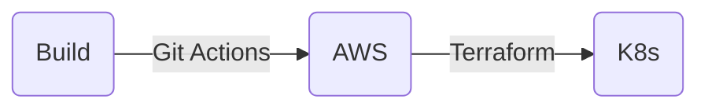

# Tech Challenge Fase 3 - IaaS "ToggleMaster"

> Análise geral e implementação do "desafio" da Fase 3 do curso DevOps e Arquitetura Cloud da FIAP.

Nesta fase, o projeto propõe a criação **automática** de um ambiente distribuído em "cloud", focado na AWS, para a execução dos microserviços do sistema ToggleMaster ([o mesmo da Fase 2][fase2]).

<BR>

## 🏗️ Arquitetura

A ToggleMaster é uma solução que permite ativar ou desativar features em produção sem a necessidade de um novo deploy. Ela foi criada de uma forma para que times de desenvolvimento possam lançar novas funcionalidades de forma segura e controlada.

O projeto da ToggleMaster com IaaS é composto de alguns recursos principais: os **microserviços**, a **infraestrutura _cloud_** e os **módulos do Kubernetes**. Esses recusos são integrados por meio de algumas ferramentas que também estão descritas neste repositório.

O sistema ToggleMaster é segmentado em 5 microsserviços altamente integrados entre si. São eles [`auth-service`][authserv], [`flag-service`][flagserv], [`targeting-service`][targetserv], [`evaluation-service`][evalserv] e [`analytics-service`][analyticserv], cada um com seu respectivo repositório original criado pela FIAP.

Os microserviços são executados em um _cloud provider_, a AWS, de modo a permitir alta flexibilidade, escalabilidade e segurança para o sistema. A infraestrutura da AWS é implementada com o Terraform, e foi segmentada em módulos a fim de automatizar e flexibilizar a criação do ambiente.

Com o ambiente AWS criado, os microserviços, então, são executados em um cluster Kubernetes (K8s), o EKS da AWS. Diversos manifestos K8s foram criados para definir como o sistema ToggleMaster deve ser executado e escalado no ambiente. No cluster também é implementado o ArgoCD para que o _deploy_ seja automatizado e sincronizado com o repositório Git.

De forma simplificada, este é o fluxo geral de implementação do sistema ToggleMaster:



<BR>

## 🔑 Prerequisitos

- Faça um **"_fork_" deste repositório** a fim de executar o CI workflow. Ele é utilizado principalmente para enviar as imagens dos microserviços ao AWS ECR;
- O serviço de **"_Actions_" precisa estar habilitado** no repositório;
- Copie o código-fonte do repositório para um dispositivo de desenvolvimento. Recomenda-se **clonar o repositório com o Git**:
    - `git clone https://github.com/SUA_CONTA/FORK_DO_REPO.git && cd FORK_DO_REPO`;
- O terminal local deve estar **autenticado na AWS** com o [**AWS CLI**][awscli];
- É necessário [**instalar o Terraform**][terraform] para implementar os serviços da AWS que serão utilizados pelo sistema ToggleMaster;
- O **`kubectl`** é necessário para gerenciar o cluster Kubernetes e seus recursos. Recomenda-se instalá-lo utilizando o [**repositório oficial do Kubernetes**][kuberepo];
- _(Opcional)_ O [cliente ArgoCD CLI][argocdcli] pode ser instalado para auxiliar as configurações da ToggleMaster no cluster. Na implementação são oferecidos alguns scripts que utilizam ele.

<BR>

## 🛠️ Roteiro de Implementação

### 1. Configurações

Para a implementação inicial, alguns dados precisam ser configurados para permitir que o ambiente seja criado de forma consistente e atendendo às características do ambiente.

#### 1.1 Variáveis Terraform

O arquivo `terraform.tfvars` deve ser definido com as principais variáveis do Terraform. É disponibilizado um arquivo de exemplo (`terraform.tfvars.example`) com alguns valores pré-definidos, mas é **altamente recomendado que as variáveis abaixo sejam definidas de acordo com o ambiente**.

| Variável | Descrição | Default |
| :---: | :--- | :--- |
| `name_prefix` | Prefixo do nome dos recursos _ | _`fiap-toggle`_ |
| `aws_region` | Regiao da AWS | _`us-east-1`_ |
| `subnet_prefix` | Os 2 primeiros octetos do CIDR da VPC | _`10.12`_ |
| `db_name` | Nome do banco de dados inicial no RDS | _vazio_ |
| `db_username` | Usuário master do PostgreSQL | _vazio_ |
| `db_password` | Senha do usuário master | _vazio_ |
| `git_org` | Domínio provedor Git | _vazio_ |
| `git_repo` | Repositório do provedor Git | _vazio_ |

Copie o arquivo de exemplo e edite ele com os valores do seu ambiente.

```bash
cp terraform.tfvars.example terraform.tfvars
# [vi]/[nano] terraform.tfvars
```

<BR>

### 2. Inicialização AWS

Para a estruturação do ambiente AWS, é utilizado o **Terraform**. Ele faz a configuração de todos os recursos utilizados pela ToggleMaster, como o EKS, Elasticache, DynamoDB, etc. Além de implementar os serviços, ele também utiliza serviços extras da AWS para a persistência do estado da infraestrutura e configuração criada. O **S3 Bucket** é utilizado para armazenar o arquivo `terraform.tfstate` que "mapeia" a configuração com o recursos criados no _Cloud Provider_. O Terraform também utiliza o **DynamoDB** para armazenar o "_state lock_" e evitar modificações concorrentes.

Esses serviços "extras" precisam ser configurados antes da inicialização do Terraform para que ele crie a persistência do estado da configuração. Portanto, o script [`init.sh`][init] está disponível para configurar o ambiente na AWS e inicializar o Terraform em seguida. Ele deve ser executado na raiz do repositório.

```bash
./init.sh
``` 

Após a inicialização do ambiente, o Terraform estará preparado para aplicar as configurações na AWS. Para isso, basta executar o "Plan" e "Apply" do Terraform conforme abaixo.

```bash
terraform plan
terraform apply
```

> A criação dos recursos pode levar alguns minutos, principalmente por causa do cluster EKS e seus nodes. Ao final, será apresentada uma mensagem indicando o término da implementação seguido dos outputs gerados. Algo similar à mensagem abaixo.

> ```
> Apply complete! Resources: 69 added, 0 changed, 0 destroyed.
> ```

<BR>

### 2.1 Configuração `kubectl`

Após a criação dos recursos na AWS, o cluster EKS deve estar disponível. É necessário atualizar a configuração do `kubectl` para o acesso ao cluster. Utilize o comando abaixo para isso.

> Altere o nome do cluster caso seja diferente.

```bash
aws eks update-kubeconfig --region $(aws configure get region) --name "$(grep '^name_prefix' terraform.tfvars | cut -d '"' -f 2)-eks-cluster"
```

<BR>

### 2.2 Configuração de credenciais

Considerando a arquitetura atual do sistema ToggleMaster, algumas credenciais sensíveis só podem ser definidos após a criação da infraestrutura na AWS. Para isso, é utilizado o gerenciador de segredos da AWS (_AWS Secrets Manager_). Alguns valores são extraídos dos outputs do Terraform, outros devem ser definidos manualmente. Eles são considerados sensíveis para evitar a exposição em repositórios públicos.

⚠️ Note que os secrets criados abaixo utilizam o namespace igual ao prefixo do nome dos recursos utilizados no Terraform ("_fiap-toggle_" por padrão). Altere caso utilize outro nome.

#### MasterKey do microserviço Auth

É necessário definir uma chave "mestre" para o microserviço de autenticação Auth.

> **Altere o valor de exemplo _`admin123`_ para algo mais complexo e seguro.**

```bash
aws secretsmanager create-secret \
    --name "fiap-toggle/master_key" \
    --description "Chave mestre para o microserviço de autenticação Auth" \
    --secret-string '{"password": "admin123"}'
```

<BR>

#### Token do microserviço Evaluation

É necessário definir um _token_ para o microserviço Evaluation. No entanto, só é possível gerar essa chave após a inicialização do microserviço Auth.

> **Altere o valor de exemplo _`teste`_ para algo mais complexo e seguro.**

```bash
aws secretsmanager create-secret \
    --name "fiap-toggle/service_api_key" \
    --description "Chave de serviço para o microserviço Evaluation" \
    --secret-string '{"api_key": "teste"}'
```

<BR>

## 3. Build da ToggleMaster

Com o ambiente AWS criado, os microserviços da ToggleMaster já podem ser enviados ao repositório de imagens ECR. Elas são construídas e enviadas ao repositório de forma automática através de um _Git actions workflow_. Com esse serviço ativo no repositório, basta submeter um novo _push_ ou _pull request_ em qualquer arquivo do diretório `build`, que workflow é disparada. Alternativamente, principalmente para o primeiro build, também é possível acionar o workflow manualmente.

<BR>

## 4. Configuração ArgoCD

Esta implementação utiliza o ArgoCD para que a ToggleMaster seja atualizada dinamicamente no cluster EKS. O plano do Terraform já está preparado para instalar o ArgoCD, ficando acessível ao cluster. Entretanto, podem ser necessários alguns ajustes após a disponibilização da aplicação.

<BR>

### 4.1 Interface do ArgoCD

O ArgoCD é configurado por padrão criar um serviço do tipo "_`ClusterIP`_" no K8s, a fim de evitar exposições desnecessárias e custos extras. No entanto, é possível alterar essa configuração no arquivo de [variáveis do Terraform][tfvars] (_`terraform.tfvars`_). Basta alterar de _`ClusterIP`_ para _`LoadBalancer`_.

#### ClusterIP

Com o serviço do tipo `ClusterIP`, pode-se acessar a interface do ArgoCD utilizando o `port-forward` do Kubernetes, como no exemplo abaixo.

```bash
kubectl port-forward service/argocd-server -n argocd --address 0.0.0.0 8080:443
```

#### LoadBalancer

Caso tenha configurado o serviço como `LoadBalancer`, o _cloud provider_ disponibilizará um _endpoint_ público para acesso à interface. Pode-se obter o _endpoint_ com o comando abaixo.

```bash
kubectl get svc argocd-server -n argocd -o=jsonpath='{.status.loadBalancer.ingress[0].ip}'
```

<BR>

### 4.2 Senha inicial do ArgoCD

O usuário padrão do ArgoCD é `admin`, mas a senha é aleatória. A senha inicial do ArgoCD é gerada automaticamente e salva no _secret_ do K8s chamado `argocd-initial-admin-secret`. O comando abaixo utiliza o `kubectl` e retorna a senha em texto-claro.

```bash
kubectl get secret -n argocd argocd-initial-admin-secret -o jsonpath="{.data.password}" | base64 -d
```

### 4.3 Registrar o cluster

As credenciais do cluster K8s devem ser registradas no ArgoCD e isso **só é necessário ao utilizar o ArgoCD em um cluster externo.**

> **Estes passos utilizam o [_ArgoCD client_][argocdcli]. Caso esteja utilizando o serviço do tipo ClusterIP, é necessário fazer o _port-forward_ primeiro. Se o serviço for do tipo LoadBalancer, utilize o _endpoint_ criado pelo _cloud provider_.**

1. Faça o login no ArgoCD pelo terminal.

```bash
argocd login [servidor:porta]
```

2. Verifique se o ArgoCD está registrado no cluster EKS. Normalmente, essa verificação deve indicar o valor, conforme abaixo.

```bash
argocd cluster list
```

> **Execute o próximo passo somente se o ArgoCD não se conectar ao cluster EKS corretamente.**

<BR>

## 4. Configuração ToggleMaster

Após criar os recursos da AWS, o Terraform disponibilizará _outputs_ com algumas configurações que serão utilizadas pelo sistema ToggleMaster. É necessário definir essas configurações como variáveis para a ToggleMaster, como URLs de repositórios ECR, Elasticache Valkey, RDS e SQS.

Esses valores podem ser aplicados na definição do ArgoCD que aplicará a ToggleMaster no cluster EKS. Para isso, é disponibilizado o arquivo `argo_deploy.yaml.example` no diretório `argo` deste repositório. Nele devem ser incluídos os valores corretos que serão aplicados no ambiente, conforme os outputs gerados pelo Terraform. O script `argo_update.sh` facilita o preenchimento dos valores corretos fazendo uma cópia do exemplo já com os valores preenchidos. Alternativamente, também é possível editar manualmente o arquivo de exemplo.

```bash
./argo/argo_update.sh
```

**O novo arquivo `argo_deploy.yaml` será responsável por definir a sincronização do repositório com o Kubernetes e deve ser aplicado conforme o comando abaixo.**

```bash
kubectl apply -f argo/argo_deploy.yaml
```

<BR>

## 📝 Observações

- A depender da instância utilizada na criação do CI workflow, podem haver diferenças ou limitações nas ações. No entanto, o workflow possui muita flexibilidade para diferentes cenários.
- A autenticação na AWS pode ser realizada com o OIDC. No entanto, devido à relação de certificados e restrições em portas de serviços, o uso de secrets pode ser necessário para ambientes de CI fora do GitHub, como ambientes self-hosted.
- O AWS CLI foi utilizado em alguns passos para:
    - Evita variáveis e suposições específicas do GitHub em ações pré-definidas;
    - Funcionar de forma consistênte no GitHub, Gitea e outro runners self-hosted.
- A verificação de vulnerabilidades da imagem pode ser realiza na AWS, no entanto, podem haver custos implícitos.

- Considerando que o objetivo desta implementação é atualizar os microserviços automaticamente com o ArgoCD, não há necessidade de atualizar o valor da tag das imagens construídas no manifesto de deployment dos microserviços, haja vista que o ArgoCD pode detectar a tag mais recente do _registry_.
- Devido ao volume de serviços implementados no cluster EKS, a quantidade de pods pode ser um pouco elevada, considerando serviços como o Keda, Helm, ArgoCD, o próprio cluster, etc. Portanto, é interessante definir uma instância EC2 da AWS que permita um número maior de alocações de IPs. Neste projeto, foi utilizada a instância `m7i-flex.large`.

[fase2]: https://github.com/diasdmhub/fiap-toggle-master-microservices
[awscli]: https://aws.amazon.com/cli/
[terraform]: https://developer.hashicorp.com/terraform/install
[kuberepo]: https://kubernetes.io/docs/tasks/tools/
[init]: ./init.sh
[helm]: https://helm.sh/docs/intro/install
[extsecret]: https://external-secrets.io/
[argocdcli]: https://argo-cd.readthedocs.io/en/stable/cli_installation/
[keda]: https://keda.sh/docs/2.19/deploy/#yaml
[authserv]: https://github.com/FIAP-TCs/auth-service
[flagserv]: https://github.com/FIAP-TCs/flag-service
[targetserv]: https://github.com/FIAP-TCs/targeting-service
[evalserv]: https://github.com/FIAP-TCs/evaluation-service
[analyticserv]: https://github.com/FIAP-TCs/analytics-service
[tfvars]: #11-vari%C3%A1veis-terraform