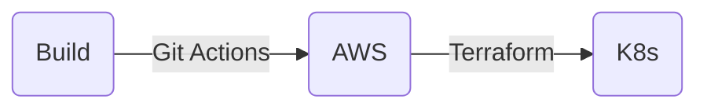

# Tech Challenge Fase 3 - IaaS "ToggleMaster"

> Análise geral e implementação do "desafio" da Fase 3 do curso DevOps e Arquitetura Cloud da FIAP.

Nesta fase, o projeto propõe a criação **automática** de um ambiente distribuído em "cloud", focado na AWS, para a execução dos microserviços do sistema ToggleMaster ([o mesmo da Fase 2][fase2]).

A ToggleMaster é uma solução que permite ativar ou desativar features em produção sem a necessidade de um novo deploy. Ela foi criada de uma forma para que times de desenvolvimento possam lançar novas funcionalidades de forma segura e controlada.

 

## 🏗️ Arquitetura

O projeto da ToggleMaster com IaaS é composto de alguns recursos principais: os **microserviços**, a **infraestrutura _cloud_** e os **módulos do Kubernetes**. Esses recusos são integrados por meio de algumas ferramentas que também são descritas mais adiante.

O sistema ToggleMaster é segmentado em 5 microsserviços altamente integrados entre si. São eles [`auth-service`][authserv], [`flag-service`][flagserv], [`targeting-service`][targetserv], [`evaluation-service`][evalserv] e [`analytics-service`][analyticserv], cada um com seu respectivo repositório original criado pela FIAP.

Os microserviços são executados em um _cloud provider_, a AWS, de modo a permitir alta flexibilidade, escalabilidade e segurança para o sistema. A infraestrutura da AWS é implementada com o Terraform, e foi segmentada em módulos a fim de automatizar e flexibilizar a criação do ambiente.

Com o ambiente AWS criado, os microserviços, então, são executados em um cluster Kubernetes (K8s), o EKS da AWS. Diversos manifestos K8s foram criados para definir como o sistema ToggleMaster deve ser executado e escalado no ambiente. No cluster também é implementado o ArgoCD para que o _deploy_ seja automatizado e sincronizado com o repositório Git.

De forma simplificada, este é o fluxo geral de implementação do sistema ToggleMaster:

 

## 🔑 Prerequisitos

- Faça um **"_fork_" deste repositório** a fim de executar o CI workflow. Ele é utilizado principalmente para enviar as imagens dos microserviços ao AWS ECR;
- O serviço de **"_Actions_" precisa estar habilitado** no repositório;
- Copie o código-fonte do repositório para um dispositivo de desenvolvimento. Recomenda-se **clonar o repositório com o Git**:
    - `git clone https://github.com/SUA_CONTA/FORK_DO_REPO.git && cd FORK_DO_REPO`;
- O terminal local deve estar **autenticado na AWS** com o [**AWS CLI**][awscli];
- É necessário [**instalar o Terraform**][terraform] para implementar os serviços da AWS que serão utilizados pelo sistema ToggleMaster;
- O **`kubectl`** é necessário para gerenciar o cluster Kubernetes e seus recursos. Recomenda-se instalá-lo utilizando o [**repositório oficial do Kubernetes**][kuberepo];
- _(Opcional)_ O [cliente ArgoCD CLI][argocdcli] pode ser instalado para auxiliar as configurações da ToggleMaster no cluster. Na implementação são oferecidos alguns scripts que utilizam ele.

 

---

### [↗️ Roteiro de implementação](/roteiro/)

---

 

## 📝 Considerações

- A depender da instância utilizada na criação do CI workflow, podem haver diferenças ou limitações nas ações. No entanto, o workflow possui muita flexibilidade para diferentes cenários.
- A autenticação na AWS pode ser realizada com o OIDC. No entanto, devido à relação de certificados e restrições em portas de serviços, o uso de secrets pode ser necessário para ambientes de CI fora do GitHub, como ambientes self-hosted.
- O AWS CLI foi utilizado em alguns passos para:
    - Evita variáveis e suposições específicas do GitHub em ações pré-definidas;
    - Funcionar de forma consistênte no GitHub, Gitea e outro runners self-hosted.
- A verificação de vulnerabilidades da imagem pode ser realiza na AWS, no entanto, podem haver custos implícitos.

- Considerando que o objetivo desta implementação é atualizar os microserviços automaticamente com o ArgoCD, não há necessidade de atualizar o valor da tag das imagens construídas no manifesto de deployment dos microserviços, haja vista que o ArgoCD pode detectar a tag mais recente do _registry_.
- Devido ao volume de serviços implementados no cluster EKS, considerando serviços como o Keda, Helm, ArgoCD, External Secrets, o próprio cluster, e a ToggleMaster, a quantidade de pods pode ser um pouco elevada. No Kubernetes, cada pod recebe um endereço IP privado. Portanto, é necessário definir uma instância EC2 da AWS que permita um número maior de [alocações de IPs por interface][ipalloc]. Neste projeto, foi utilizada a instância `m7i-flex.large` que é elegível como "_free tier_" e permite até 10 alocações de IPs.

- Devido às exigências do desafio desta fase 3, os recursos da AWS são altamente integrados e dependentes entre si. Eles pecisam ser configurados com atenção apesar da modularização com o Terraform. O sistema ToggleMaster é altamente dependente de cada um dos módulos implementados e não possui muita flexibilidade para migração de ambientes.
- Apesar do sistema ToggleMaster ser bem flexível e, em parte, desacoplado, a infraestrutura proposta para ele é altamente complexa e dependente entre si. Como visto no [código atual do sistema][codatual], e apesar dos [princípios dos 12-Fatores discutidos na fase 1][12factor] do projeto, a ToggleMaster está desacoplada, mas ainda possui alta dependência entre si. A situação é agravada ao introduzir o _cloud provider_ como serviço de hospedagem da aplicação. Neste caso, a infraestrutura da AWS se mostra mais complexa e despendiosa para hospedar a ToggleMaster, gerando um custo operacional possivelmente elevado.
- A automação proposta para este ambiente é de elevada complexidade e pode exigir manutenção especializada. Ela é muito útil para explorar diversos recursos computacionais de _cloud providers_, e recursos de aplicações amplamente utilizadas no mercado tecnológico. Todavia, sua implementação não parece justificar o custo operacional.

[fase2]: https://github.com/diasdmhub/fiap-toggle-master-microservices
[awscli]: https://aws.amazon.com/cli/
[terraform]: https://developer.hashicorp.com/terraform/install
[kuberepo]: https://kubernetes.io/docs/tasks/tools/
[argocdcli]: https://argo-cd.readthedocs.io/en/stable/cli_installation/
[authserv]: https://github.com/FIAP-TCs/auth-service
[flagserv]: https://github.com/FIAP-TCs/flag-service
[targetserv]: https://github.com/FIAP-TCs/targeting-service
[evalserv]: https://github.com/FIAP-TCs/evaluation-service
[analyticserv]: https://github.com/FIAP-TCs/analytics-service
[ipalloc]: https://docs.aws.amazon.com/AWSEC2/latest/UserGuide/AvailableIpPerENI.html
[codatual]: #-arquitetura
[12factor]: https://github.com/diasdmhub/fiap-toggle-master-monolith